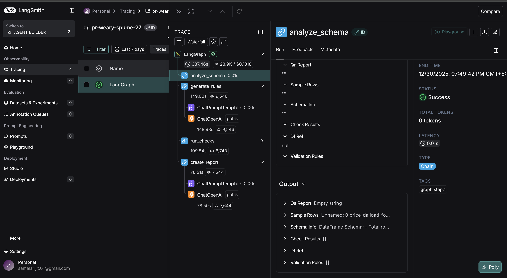

# euro_grid — Setup & Run Instructions

This repository is **notebook-first**: the full pipeline (data ingestion → QA → EDA → forecasting → AI QA → `submission.csv`) is implemented in **`euro_grid_forecast.ipynb`**. You should start there and run the notebook top-to-bottom.

## Prerequisites

- **Python**: 3.12 recommended (matches the notebook kernel metadata)
- **API keys**:
  - **ENTSO‑E**: `ENTSOE_API_KEY` (required to fetch data)
  - **OpenAI**: `OPENAI_API_KEY` (required for the LangGraph/LLM QA section)
  - **LangSmith** (optional): `LANGCHAIN_API_KEY` (to trace LLM calls)

## 1) Install dependencies

From the repository root:

```bash
python -m venv .venv
source .venv/bin/activate
pip install -r requirements.txt
```

If you prefer Conda:

```bash
conda create -n euro_grid python=3.12 -y
conda activate euro_grid
pip install -r requirements.txt
```

## 2) Create `.env` (required)

Create a `.env` file in the repository root (this file is **git-ignored**):

```env
# --- Required for ENTSO-E ingestion ---
ENTSOE_API_KEY=YOUR_ENTSOE_API_KEY

# --- Required for LLM-driven QA (LangGraph + LangChain) ---
OPENAI_API_KEY=YOUR_OPENAI_API_KEY

# --- Optional: LangSmith tracing (recommended for debugging) ---
LANGCHAIN_TRACING_V2=true
LANGCHAIN_ENDPOINT=https://api.smith.langchain.com
LANGCHAIN_PROJECT=euro_grid
LANGCHAIN_API_KEY=YOUR_LANGSMITH_API_KEY
```

Notes:
- **Do not commit** `.env`. Keep secrets local.
- If you don’t want LangSmith, you can omit the `LANGCHAIN_*` lines.

## 3) Run the notebook

Launch Jupyter from the repo root:

```bash
jupyter lab
```

Open **`euro_grid_forecast.ipynb`** and run **Run All** (or execute sections in order).

### Important runtime notes

- **ENTSO‑E access**: Section 2 will call ENTSO‑E APIs. If your key is missing/invalid, ingestion will fail.
- **LLM QA**: Section 7 will call OpenAI via LangChain (`ChatOpenAI`). Ensure `OPENAI_API_KEY` is set.
- **LLM model selection**: The notebook sets the model name in the Section 7 setup cell (e.g. `ChatOpenAI(model=...)`).
- **Restart kernel after editing `.env`**: If you add/change `.env`, restart the notebook kernel so the environment variables are reloaded.

## 4) Outputs you should see

Running the notebook generates:

- **`submission.csv`** (repo root): out-of-sample predictions with columns `id`, `y_pred`
- **`data/`**: raw and intermediate data files (downloaded/generated by the notebook during ingestion)
- **`models/`**: saved model artifacts (all models and best model as pickle files)
- **`outputs/`**: figures + model comparison artifacts (e.g. `outputs/model_comparison_full.csv`)
- **`reports/`**: LLM QA report artifacts (e.g. `reports/llm_qa_report.json`, `reports/llm_qa_report.md`)
- **`logs/`**: pipeline logs and LLM audit logs (paths may be created at runtime)

## 5) LangSmith tracing (debugging)

If you set the `LANGCHAIN_*` variables in `.env`, LangChain will automatically trace LLM calls to LangSmith.

Recommended setup:

1. Create a LangSmith account and API key.
2. Add the LangSmith settings to `.env` (see above).
3. Restart the notebook kernel.
4. Run Section 7 (LangGraph QA). You should see traces in your LangSmith project (e.g. `euro_grid`).

What you get:
- Prompt + response visibility
- Latency/token usage (depending on account settings)
- Step-by-step graph execution insights for debugging

### Example trace (LangGraph run)

Below is an example of a LangSmith trace captured from the notebook’s LangGraph QA workflow (showing node-level timing and the underlying LLM calls). This is useful for debugging prompt issues, rule-generation failures, and overall pipeline latency.


